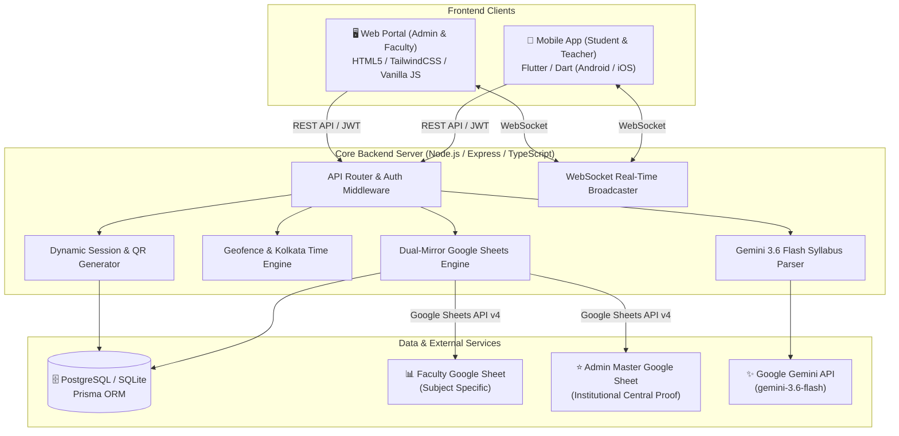
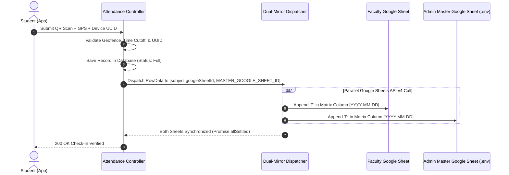
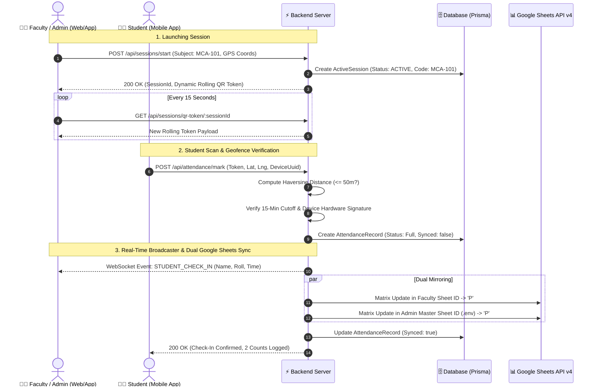

# 🎓 Smart Student Attendance System - Complete Documentation & Operation Manual

**Version**: 2.5 (Production Release)  
**Author / Super Admin**: Sayantan Dasgupta  
**Repository**: `bugsnaxor-exe/Smart-Student-Attendance-System`  
**Target Environments**: Web Portal (Desktop / Browser) & Mobile App (Android / iOS Flutter)

---

## 📑 Table of Contents
1. [Executive Summary & System Architecture](#1-executive-summary--system-architecture)
2. [User Roles & Permissions Matrix](#2-user-roles--permissions-matrix)
3. [Deep-Dive into Core Dynamic Mechanics](#3-deep-dive-into-core-dynamic-mechanics)
   * [3.1 Dynamic Rotating QR Code Protocol](#31-dynamic-rotating-qr-code-protocol)
   * [3.2 50-Meter Geofencing & 15-Minute Cutoff Window](#32-50-meter-geofencing--15-minute-cutoff-window)
   * [3.3 Anti-Proxy Device Hardware UUID Binding](#33-anti-proxy-device-hardware-uuid-binding)
   * [3.4 Real-Time Dual-Mirror Google Sheets Engine](#34-real-time-dual-mirror-google-sheets-engine)
   * [3.5 Manual Attendance Override (`Grant Full`)](#35-manual-attendance-override-grant-full)
   * [3.6 AI-Powered Syllabus Parser (Gemini 3.6 Flash)](#36-ai-powered-syllabus-parser-gemini-36-flash)
   * [3.7 Faculty Approval Gate & Access Control](#37-faculty-approval-gate--access-control)
4. [Step-by-Step User Workflows](#4-step-by-step-user-workflows)
   * [4.1 Super Admin Complete Workflow](#41-super-admin-complete-workflow)
   * [4.2 Faculty Member Workflow](#42-faculty-member-workflow)
   * [4.3 Student Mobile App Workflow](#43-student-mobile-app-workflow)
5. [End-to-End Real-Time Process Flow Diagram](#5-end-to-end-real-time-process-flow-diagram)
6. [API & WebSocket Event Reference](#6-api--websocket-event-reference)
7. [Database Schema & Data Models](#7-database-schema--data-models)
8. [Configuration & Environment Reference](#8-configuration--environment-reference)

---

## 1. Executive Summary & System Architecture

The **Smart Student Attendance System** is an enterprise-grade academic platform engineered to eliminate attendance proxying, automate institutional record-keeping, and give faculty and administrators real-time visibility into classroom attendance.



### Technology Stack:
* **Backend**: Node.js, Express, TypeScript, Prisma ORM, WebSockets (`ws`).
* **Database**: PostgreSQL / SQLite with structured relational schema.
* **Mobile Client**: Flutter 3.x, Dart, Provider state management, Geolocator, Mobile Scanner, Device Info Plus.
* **Web Portal**: HTML5, TailwindCSS, WebSocket Client, Google Sheets API v4 OAuth2 Service Account integration.
* **AI Engine**: Google Generative AI SDK (`@google/genai` with `gemini-3.6-flash`).

---

## 2. User Roles & Permissions Matrix

| Feature / Operation | Super Admin (Sayantan Dasgupta) | Registered Faculty Member | Student |
| :--- | :---: | :---: | :---: |
| **Login / Authentication** | ✅ Global Passkey / Credentials | ✅ Email + Password (Post Approval) | ✅ Roll Number + Password |
| **Faculty Approval Gate** | ✅ Approve / Reject Teachers | ❌ None | ❌ None |
| **Syllabus PDF Upload (Gemini AI)** | ✅ Full Ingestion & Parsing | ❌ None | ❌ None |
| **Start Attendance Session** | ✅ Any Subject (Sem 1–4) | ✅ Assigned Subject Only | ❌ None |
| **Dynamic Rolling QR Display** | ✅ Web Portal & App | ✅ Web Portal & App | ❌ None |
| **Scan QR Code & Check In** | ❌ None | ❌ None | ✅ Mobile Camera + GPS |
| **Manual Attendance Override (`P`)** | ✅ Web Portal | ✅ Web Portal & Mobile App | ❌ None |
| **Connect Personal Google Sheet** | ✅ Master & Subject Sheets | ✅ Own Subject Sheet | ❌ None |
| **View Audit Reports & Export** | ✅ Full Department | ✅ Assigned Subject | ❌ None |
| **View Personal Attendance History**| ❌ None | ❌ None | ✅ Subject % & History |

---

## 3. Deep-Dive into Core Dynamic Mechanics

### 3.1 Dynamic Rotating QR Code Protocol
To prevent students from taking photos or screenshots of the QR code and sharing them with absent peers:
1. **Dynamic Payload**: Every QR code contains an encrypted, time-sensitive JSON payload:
   $$\text{QR Payload} = \{ \text{sessionId}, \text{subjectId}, \text{token}, \text{timestamp} \}$$
2. **Rolling Rotation**: The session token automatically refreshes every **15 seconds**.
3. **One-Time Consumption & Expiry**: The backend invalidates stale tokens immediately upon expiration or once an active rotation cycle finishes.

---

### 3.2 50-Meter Geofencing & 15-Minute Cutoff Window
1. **Haversine Distance Calculation**:
   $$d = 2R \arcsin\left(\sqrt{\sin^2\left(\frac{\Delta \phi}{2}\right) + \cos(\phi_1)\cos(\phi_2)\sin^2\left(\frac{\Delta \lambda}{2}\right)}\right)$$
   * The student's live GPS coordinates must be within **50.0 meters** of the teacher's active location or the Department anchor point.
2. **15-Minute Geofence Cutoff**:
   * Once a session starts, dynamic QR attendance is open for **15 minutes**.
   * After 15 minutes, student GPS check-in automatically closes to prevent late arrivals from bypassing the physical cutoff. Latecomers must request a **Manual Full Attendance Override** from the teacher or admin.

---

### 3.3 Anti-Proxy Device Hardware UUID Binding
1. On the student's first login, the mobile app extracts the hardware signature (`androidId` / `identifierForVendor`).
2. The hardware UUID is permanently bound to the student's database record (`StudentProfile.deviceUuid`).
3. If another student attempts to log in using the same phone, or if a student tries to sign in from an unregistered phone, check-in is **blocked immediately**.

---

### 3.4 Real-Time Dual-Mirror Google Sheets Engine
The system synchronizes every attendance check-in across **two spreadsheets simultaneously**:



* **Matrix Format**:
  * **Columns A–D**: `[Class Roll | University Roll | Registration Number | Student Name]`
  * **Dynamic Date Columns**: Header created as `2026-09-02 [MCA-101 • Sem 1]`.
  * **Attendance Mark**: Sets **`P`** for present students. Absent students remain clean blank cells.
* **Subject-Level Independence**:
  * Up to 30+ faculty members can configure their own Google Sheet IDs.
  * Linking a sheet to `MCA-101` will never overwrite the sheet for `MCA-102` or `MCA-301`.
  * The Admin Master Sheet (`MASTER_GOOGLE_SHEET_ID` in `.env`) receives a simultaneous mirror of **every single subject's attendance**.

---

### 3.5 Manual Attendance Override (`Grant Full`)
* If a student enters late due to verified institutional work, both the Super Admin and the Faculty Member have access to **`[ Grant Full ]`**.
* **Action**:
  1. Sets database status to **`Full`** (giving full 2-attendance weight).
  2. Updates local UI table and matrix immediately.
  3. Writes **`'P'`** directly into **both** the Faculty Google Sheet and the Admin Master Sheet.
  4. Broadcasts real-time WebSocket check-in notification to the teacher's screen.

---

### 3.6 AI-Powered Syllabus Parser (Gemini 3.6 Flash)
* **Model**: `gemini-3.6-flash`.
* **Multimodal Direct Stream**: Accepts raw university PDF files (e.g. MAKAUT MCA Syllabus) and streams the base64 buffer directly to Gemini.
* **Structured Output**: Gemini parses and generates complete JSON subject structures:
  * Course Code (e.g. `MCA-101`)
  * Course Name (e.g. `Mathematical Foundation`)
  * Course Type (`Theory`, `Practical`, `Bridge Course`)
  * Credits (`4`) & L-T-P Hours (`3+1+0`)
  * Semester (`1` to `4`)
* **One-Click Ingestion**: Admin reviews the parsed subject grid and clicks **"Ingest & Apply"** to generate all subjects in the database.

---

### 3.7 Faculty Approval Gate & Access Control
1. **Teacher Registration**: When a new teacher registers, their account is flagged as `isApproved: false`.
2. **Approval Gate**: They cannot sign in until the Super Admin approves them.
3. **Admin Verification Modal**: Super Admin opens **Faculty Approvals** on the Web Portal, reviews their name, email, department, and assigned course, and clicks **`[ Approve Faculty ]`**.

---

## 4. Step-by-Step User Workflows

### 4.1 Super Admin Complete Workflow

```
[ Log in to Web Portal ] ──▶ [ Review & Approve Pending Faculty ]
            │
            ├──▶ [ Upload Syllabus PDF ──▶ Gemini 3.6 Flash Ingestion ]
            │
            ├──▶ [ Link Master Google Sheet in Settings ]
            │
            ├──▶ [ Select ANY Semester (1–4) & Subject ──▶ Start Live Session ]
            │
            └──▶ [ Monitor Real-Time Roster & Grant Full Override if needed ]
```

1. **Sign In**: Navigate to `http://localhost:4000/` and sign in as Super Admin (`sayantan05072004@gmail.com`).
2. **Verify Teachers**: Click **Faculty Approvals (N)** on the top-right navbar to approve newly registered teachers.
3. **Update Syllabus**: Click **Upload Syllabus**, drop in the course PDF, let Gemini 3.6 Flash extract the curriculum, and click **Ingest & Apply**.
4. **Conduct Session**:
   * Switch to any semester (e.g. `Semester 1`) and select a course (`MCA-101`).
   * Click **`[ Start Attendance Session ]`**.
   * A large dynamic rolling QR code will appear with a live countdown timer.
   * Watch student check-ins stream in via WebSockets in real time.
5. **Review Records**: Click **View Full Academic Audit Report** to inspect totals or download CSV/Excel exports.

---

### 4.2 Faculty Member Workflow

1. **Registration**:
   * Open the Web Portal or Mobile App.
   * Enter Name, College Email, Password, Department (`MCA`), Semester (`1–4`), and assigned Course Code.
   * Submit registration (account will be queued for Admin approval).
2. **First-Time Google Sheet Setup**:
   * Log in after approval.
   * Open **Google Sheet Settings**.
   * Copy the Service Account Email:
     `attendance-sync@total-byte-507113-g0.iam.gserviceaccount.com`
   * Open your Google Spreadsheet $\rightarrow$ Click **Share** $\rightarrow$ Add the email with **Editor** permissions.
   * Paste your Google Spreadsheet ID and click **Save & Connect**.
3. **Conducting Class Attendance**:
   * On Web Portal: Click **`[ Start Attendance Session ]`** to project the Dynamic QR code onto the classroom screen.
   * On Mobile App: Tap **Start Session** to display the QR code on your phone.
4. **Handling Latecomers**:
   * In the **Unmarked / Absent Students Roster**, locate the student's name.
   * Click / Tap **`[ Grant Full ]`**.
   * The student is instantly marked present (`P`) in your sheet and the Admin Master Sheet.

---

### 4.3 Student Mobile App Workflow

```
[ Open Student App ] ──▶ [ Hardware Device Auto-Bound ] ──▶ [ Tap 'Scan QR' ]
                                                                   │
                                                                   ▼
[ Live Attendance Logged ] ◀── [ Server Validates GPS & Token ] ◀──┘
```

1. **Sign In**: Enter University Roll Number (e.g. `12000126042`) and password.
2. **Device Registration**: The app automatically binds your phone's hardware UUID to your profile.
3. **Taking Attendance**:
   * When the teacher displays the QR code, tap **Scan Attendance QR** on your dashboard.
   * Grant Camera and GPS location permissions.
   * Point the camera at the rotating QR code.
4. **Instant Verification**:
   * The app sends your GPS coordinates, device signature, and rolling token.
   * A green confirmation screen appears: *"Attendance Recorded Successfully (2 Counts Present)"*.
5. **History & Analytics**:
   * Tap any course in your app to view total classes held, classes attended, and real-time attendance percentage.

---

## 5. End-to-End Real-Time Process Flow Diagram



---

## 6. API & WebSocket Event Reference

### 🔑 Authentication Endpoints
* `POST /api/auth/faculty/register`: Register new faculty account (pending approval).
* `POST /api/auth/faculty/login`: Faculty / Super Admin authentication.
* `POST /api/auth/student/login`: Student login & device binding.

### 📡 Session & QR Endpoints
* `POST /api/sessions/start`: Initialize active attendance session.
* `GET /api/sessions/active/:subjectId`: Fetch active session status.
* `GET /api/sessions/qr-token/:sessionId`: Fetch dynamic rolling token.
* `POST /api/sessions/close/:sessionId`: End attendance session.

### 📝 Attendance & Override Endpoints
* `POST /api/attendance/mark`: Student dynamic QR attendance check-in.
* `POST /api/override/grant-full`: Faculty & Admin manual full attendance override (`P`).
* `GET /api/override/absent/:subjectId`: Retrieve list of unmarked / absent students.
* `GET /api/attendance/teacher/:subjectId`: Complete subject attendance history & audit table.

### 📊 Google Sheets Endpoints
* `POST /api/sheets/link-sheet`: Link custom Google Sheet ID to assigned subject.
* `POST /api/sheets/test-connection`: Diagnostic permissions and tab check.

### 📄 Syllabus Parser Endpoints
* `POST /api/syllabus/upload`: Ingest PDF syllabus via Gemini 3.6 Flash.
* `POST /api/syllabus/apply`: Save parsed subjects into database.

### ⚡ WebSocket Event Structure
* **Event Name**: `STUDENT_CHECK_IN`
* **Payload**:
```json
{
  "type": "STUDENT_CHECK_IN",
  "subjectId": "MCA-101",
  "subjectCode": "MCA-101",
  "subjectName": "Mathematical Foundation",
  "student": {
    "id": "uuid-v4",
    "name": "Sayantan Dasgupta",
    "classRoll": "MCA-26-001",
    "universityRoll": "12000126001",
    "regNumber": "2026001"
  },
  "status": "Full",
  "time": "04:30:15 PM",
  "date": "2026-09-02",
  "sheetSynced": true
}
```

---

## 7. Database Schema & Data Models

```prisma
model Department {
  id        String   @id @default(uuid())
  code      String   @unique // "MCA", "CSE"
  name      String
  students  StudentProfile[]
  teachers  TeacherProfile[]
  subjects  Subject[]
}

model StudentProfile {
  id             String             @id @default(uuid())
  userId         String             @unique
  user           User               @relation(fields: [userId], references: [id], onDelete: Cascade)
  classRoll      String
  universityRoll String             @unique
  regNumber      String             @unique
  semester       Int
  deviceUuid     String?            // Hardware binding
  attendances    AttendanceRecord[]
}

model TeacherProfile {
  id             String       @id @default(uuid())
  userId         String       @unique
  user           User         @relation(fields: [userId], references: [id], onDelete: Cascade)
  isApproved     Boolean      @default(false) // Approval Gate
  subjects       Subject[]
}

model Subject {
  id            String             @id @default(uuid())
  code          String             // "MCA-101"
  name          String             // "Mathematical Foundation"
  credits       Int                @default(4)
  semester      Int                // 1, 2, 3, 4
  googleSheetId String?            // Dedicated Faculty Sheet ID
  sheetTabName  String             @default("Attendance")
  sessions      ActiveSession[]
  attendances   AttendanceRecord[]
}

model AttendanceRecord {
  id            String         @id @default(uuid())
  studentId     String
  subjectId     String
  date          String         // YYYY-MM-DD
  time          String         // HH:MM:SS AM/PM
  status        String         @default("Full") // "Full" ('P')
  syncedToSheet Boolean        @default(false)
}
```

---

## 8. Configuration & Environment Reference

File: `backend_server/.env`

```ini
# Server Port & Host
PORT=4000
NODE_ENV=production

# Database Connection URL (PostgreSQL / SQLite)
DATABASE_URL="file:./dev.db"

# JWT Secret Token
JWT_SECRET="smart_attendance_jwt_secure_key_2026"

# Google Cloud Service Account Email
GOOGLE_SERVICE_ACCOUNT_EMAIL="attendance-sync@total-byte-507113-g0.iam.gserviceaccount.com"

# Super Admin Master Proof Google Sheet ID (Central Institutional Backup)
MASTER_GOOGLE_SHEET_ID="1KN_lGqkfzE7CBdiceE8VEneQ-37vsuGFz2jTvRhsPFk"

# Google Gemini AI API Key (for Syllabus Parsing)
GEMINI_API_KEY="AIzaSy..."
```

---

### 🏆 Operational Summary & Best Practices
1. **Always Share Sheets with Editor Access**: Share any connected Google Sheet with `attendance-sync@total-byte-507113-g0.iam.gserviceaccount.com`.
2. **Keep the 15-Minute Window in Mind**: Inform students that dynamic QR check-ins close 15 minutes after session start.
3. **Use Manual Override Responsibly**: Use **`[ Grant Full ]`** for students with verified permissions or campus duties.
4. **Institutional Backup is Automatic**: Even if a faculty member disconnects or loses their personal sheet, all records are permanently preserved in the Super Admin Master Google Sheet (`MASTER_GOOGLE_SHEET_ID`) and the PostgreSQL database.
